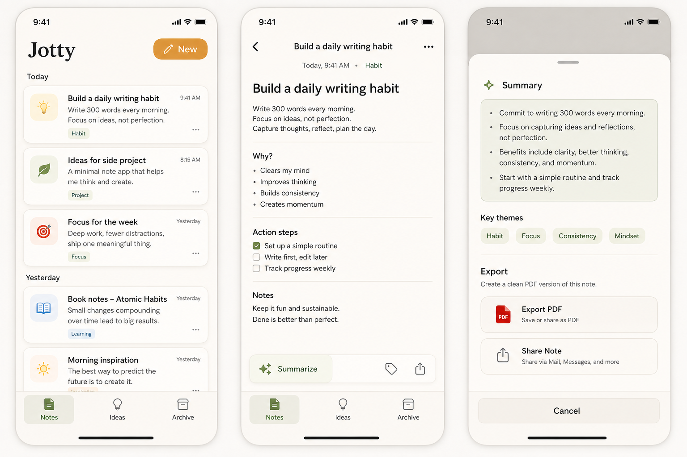

# Jotty

Jotty is a small iOS note-taking app for daily brainstorming: a quiet place to catch ideas, shape them into next actions, and export a clean PDF when a note is worth sharing.



## Current Status

This is an early SwiftUI baseline. The app already includes:

- Notes list with warm, low-friction daily brainstorming UI
- Note editor with mood segments
- Local placeholder summary generation
- PDF export and share flow
- Ideas and Archive tabs
- Public repo hygiene for open-source collaboration

The summarization is intentionally simple for now. It is a local heuristic scaffold so the product flow is usable before a smarter summarization service is added.

## Requirements

- Xcode 26.5 or newer recommended
- iOS 17.0+
- SwiftUI and Observation

## Build

Open `Jotty.xcodeproj` in Xcode and run the `Jotty` scheme.

Command-line build:

```sh
xcodebuild \
  -project Jotty.xcodeproj \
  -scheme Jotty \
  -configuration Debug \
  -sdk iphonesimulator \
  -destination 'generic/platform=iOS Simulator' \
  build CODE_SIGNING_ALLOWED=NO
```

## Roadmap

- Persist notes with SwiftData or a file-backed local store
- Replace heuristic summaries with an injected summarization service
- Add tags, search, and pinned notes
- Improve PDF templates
- Add tests for note store, summarization, and export
- Add real app icon and launch polish

## Contributing

Contributions are welcome while the app is still small and readable. Start with [CONTRIBUTING.md](CONTRIBUTING.md), then pick a small vertical slice from the roadmap or open an issue first.

## License

MIT. See [LICENSE](LICENSE).
